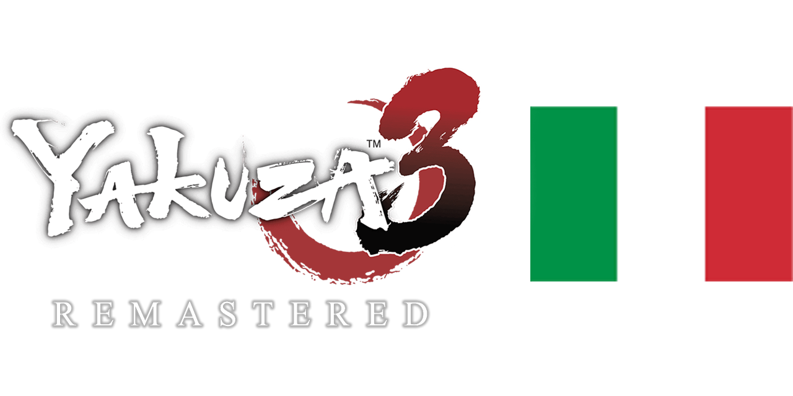
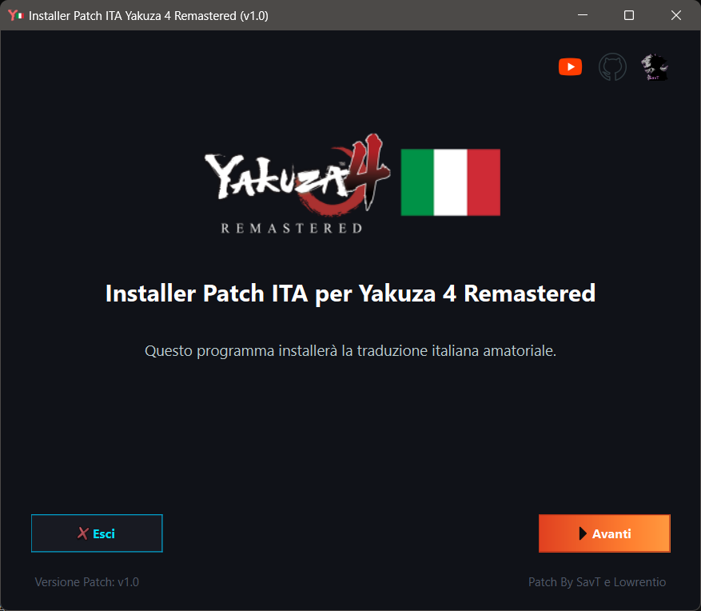
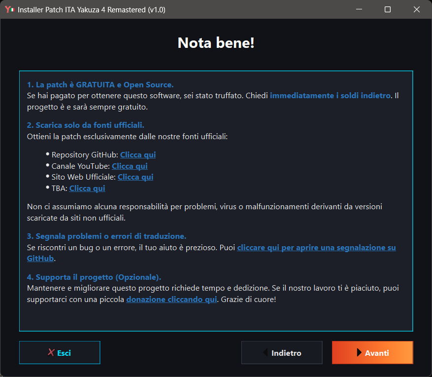
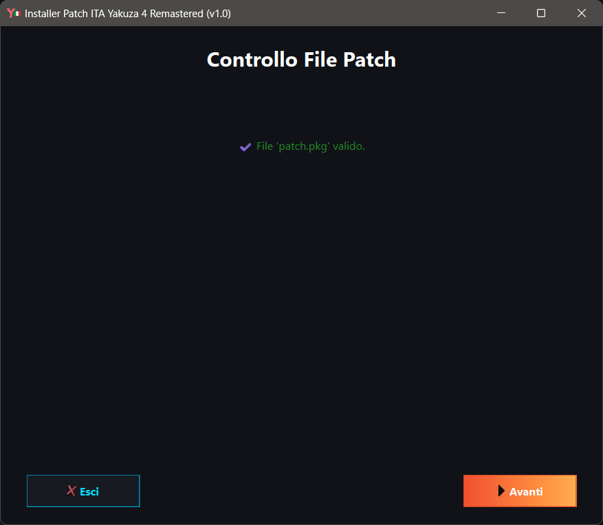
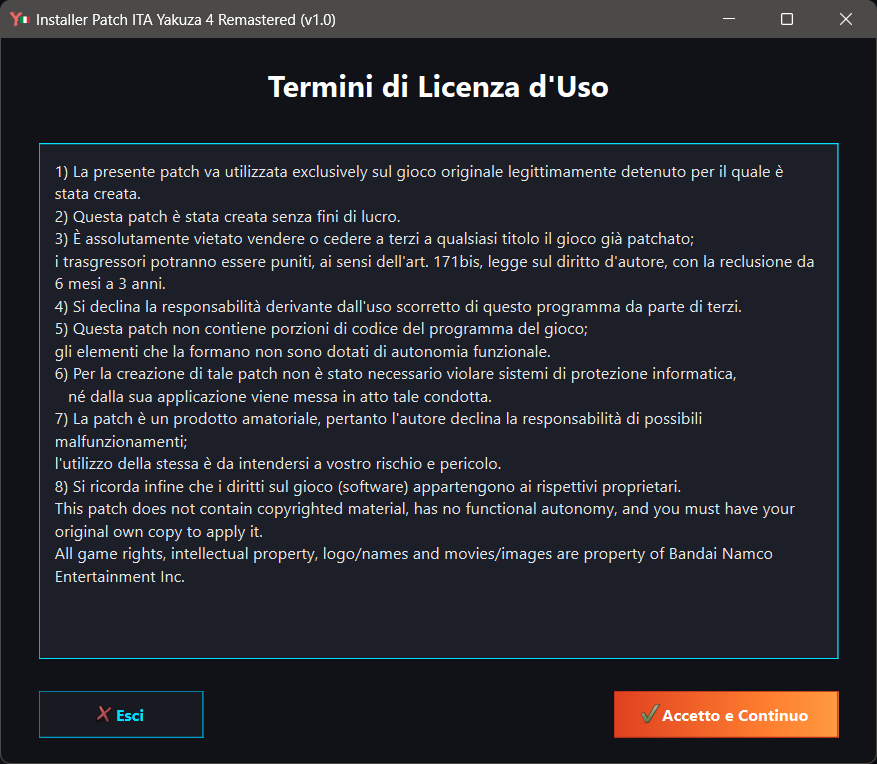
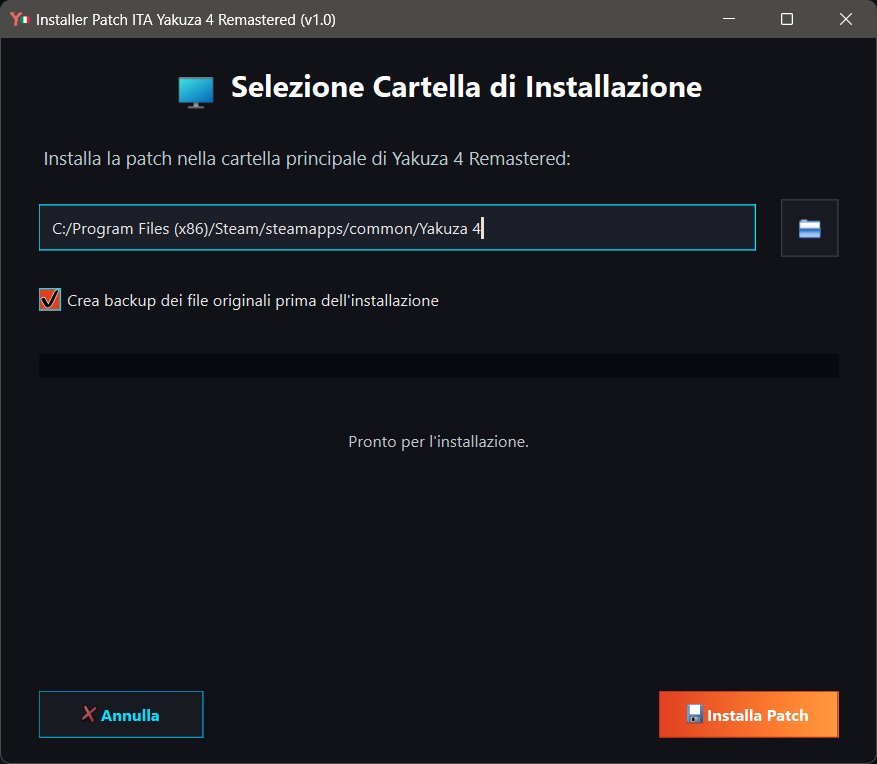

# Yakuza 3 Remastered Patch ITA
<p align="center">
  <br>
    Progetto per la traduzione del gioco Yakuza 3 REMASTERED in italiano.
</p>


[](https://www.paypal.com/paypalme/verio12)


### Un progetto per la community

Ho dato il via a questo progetto con un'idea chiara: renderlo un lavoro **fatto dalla community, per la community**. Ho messo insieme le basi, riadattando molto del lavoro già fatto per la patch di **Yakuza 4** per dare a tutti un buon punto di partenza. Ora, però, la palla passa a voi.

Il mio ruolo sarà quello di coordinare e fare da punto di riferimento, ma il vero motore di questa patch sarete voi. Ogni aiuto è fondamentale: che si tratti di correggere un refuso, migliorare una frase o tradurre intere sezioni, il vostro contributo farà la differenza. L'obiettivo è che questo progetto diventi di tutti.

### Ringraziamenti e risorse utili

Un ringraziamento speciale a **[Lowrentio](https://steamcommunity.com/id/Lowrentio/)** per aver condiviso i suoi tool e le sue traduzioni, risorse preziose che hanno arricchito e facilitato l'avvio del progetto.


### Come contribuire

Il tuo aiuto è fondamentale! Questo progetto è pensato per crescere grazie al supporto attivo della community. Se hai notato un errore di battitura, una traduzione che suona innaturale, oppure vuoi cimentarti nella traduzione di file non ancora completati, sei il benvenuto!

Per contribuire, segui questi semplici passaggi:

1. **Fai un fork** di questo repository sul tuo account GitHub.
2. Crea un **nuovo branch** per le tue modifiche (es. `git checkout -b fix-traduzione-menu`).
3. Applica le tue correzioni o traduzioni lavorando direttamente sui file `.po`. Ricorda di rispettare il tono di gioco e di non alterare le variabili di sistema (`%s`, `%d`, ecc.).
4. Esegui il commit e il push delle tue modifiche sul tuo fork.
5. Apri una **Pull Request (PR)** verso il repository principale per integrare il tuo lavoro.

> **Controlli di qualità automatici:**
> Per garantire la massima stabilità della patch, ogni volta che effettui un push o apri una Pull Request, GitHub eseguirà dei controlli automatici (tramite GitHub Actions) per validare la struttura e la sintassi dei file `.po`. Questo assicura che il formato rimanga intatto e che non vi siano problemi tecnici prima dell'unione della tua traduzione.

Puoi contribuire anche semplicemente segnalando bug, imprecisioni o offrendo suggerimenti tramite la sezione **Issue** di GitHub. Ogni singolo contributo, grande o piccolo, è prezioso per portare a termine questo progetto!

# Immagini Patch


# Come installare la patch

Per installare bisogna selezionare la sezione [Releases](https://github.com/zSavT/Yakuza3-Patch-ITA/releases) su GitHub e selezionare l'ultima versione della patch disponibile. Selezionate l'installer da scaricare in base al sistema operativo scelto ed avviate l'installer.



L'installazione è guidata e semplice, ma in ogni caso basterà sempre cliccare su "_Avanti_". Attendere la verifica dell'integrità dei file della Patch e cliccare successivamente su "_Avanti_".




Successivamente bisogna accettare i termini d'uso e poi nella schermata successiva, selezionare la cartella dove è installato Yakuza 3 (Di default è impostato il percorso classico) e cliccare su "_Installa Patch_".




# Struttura dei file

- __Yakuza 3\data\2d\cse_en.pa__
    - All'interno sono presenti la maggior parte delle grafiche del gioco, in particolare quelle per l'immagine di introduzione dei capitoli e degli obbiettivi.
    - [x] Tradotto
- __Yakuza 3\data\2d\first_load_picture_en.par__
    - All'interno sono presenti le immagini degli splash screen del primo avvio del gioco.
    - [x] Tradotto
- __Yakuza 3\data\2d\tex_common_en.par__
    - All'interno sono presenti le immagini del menu del gioco.
    - [x] Tradotto
- __Yakuza 3\data\auth\subtitle.par__
    - All'interno sono presenti tutti i testi per le cutscene presenti nel gioco.
    - [x] Tradotto
- __Yakuza 3\data\bootpar\*__
    - All'interno sono presenti vari file relativi a nomi di oggetti, descrizioni e altro.
    - [x] Tradotto
- __Yakuza 3\data\db.ogre3\*__
    - Come sopra.
    - [x] Tradotto
- __Yakuza 3\data\fontpar__
    - All'interno sono presenti i dati relativi al font del gioco.
    - [x] Tradotto
- __Yakuza 3\data\hact\subtitle.par__
    - All'interno sono presenti tutti i testi non presenti nelle cutscene o nelle classi box di dialogo o menu.
    - [x] Tradotto
- __Yakuza 3\data\minigame\*__
    - All'interno sono presenti vari file relativi ai minigiochi.
    - [x] Tradotto
- __Yakuza 3\data\pause_en.par__
    - All'interno sono presenti i testi del gioco relativi ai memo ed altro.
    - [x] Tradotto
- __Yakuza 3\data\scenario_en\mail__
    - All'interno è presente il testo delle email/sms.
    - [x] Tradotto
- __Yakuza 3\data\staffrollpar__
    - All'interno sono presenti le immagini dei crediti finali del gioco.
    - [x] Tradotto
- __Yakuza 3\data\ikusei_param_en.par__
    - All'interno sono presenti i testi del gioco relativi al Colosseo.
    - [x] Tradotto ma con limitazioni
- __Yakuza 3\data\wdr_par_en\*__
    - All'interno sono presenti i file relativi ai box di dialogo della storia e alle interazioni con i negozi.
    - [x] Tradotto

# Funzionamento estrazione PAR

Per estrarre i dati dai file PAR, è necessario utilizzare il programma "_ParTool_", sviluppato da Kaplas80 e disponibile nella [repository](https://github.com/Kaplas80/ParManager.git). Nella cartella PAR è presente il tool per comodità, insieme a un file batch per ricompattare i file. Per scompattare un file PAR, è sufficiente trascinare il file sull'eseguibile; verrà creata una cartella contenente tutti i file presenti nel file PAR. Lo stesso processo, con maggiori opzioni, può essere eseguito tramite riga di comando (per maggiori informazioni, si può consultare la repository originale).

Per ricreare il file PAR dopo le modifiche, è possibile utilizzare il file batch (modificando, se necessario, solo i parametri di input e output) oppure tramite riga di comando, come nell'esempio seguente:

```
.\ParTool.exe create [nome cartella di input] [nome file par output] -c 1
```
Ovviamente, le parentesi quadre non devono essere incluse nel comando.

# Funzionamento estrazione MSG

Per i file MSG, si utilizza il programma realizzato da [BZ](https://brazilalliance.com.br/).

# Funzionamento installer

Per poter creare correttamente l'installer bisogna prima di tutto utilizzare ```packager.py``` per poter generare il file criptato della cartella "_data_". Lo script è guidato e bisogna solo indicare il percorso della cartella con le modifiche della Patch ed il nome del file pkg criptato. Nel file "chiave.txt" bisogna inserire la chiave di criptazione scelta.

## Creazione dell'eseguibile

Per poter generare l'eseguibile dello script bisogna utilizzare la libreria "__pyinstaller__" e generare l'eseguibile con i comandi in base al sistema operativo di arrivo.

### Windows

Per generare l'eseguibile dell'installer per Windows, bisogna utilizzare il seguente comando:
```ps
pyinstaller --onefile --windowed --hidden-import=webbrowser --hidden-import=pyzipper --hidden-import=sys --hidden-import=os --hidden-import=platform --hidden-import=traceback --hidden-import=PyQt6 --icon=assets/logo.png --add-data "assets:assets" --add-data "patch.pkg:." --add-data "chiave.txt:." installer.py
```
Nella cartella "_dist_", è presente l'eseguibile.
### Linux (Steam Deck)

Per generare l'eseguibile per Linux, bisogna fare qualche passaggio in più. L'installer è creato tramite la WSL per Windows.
Per prima cosa bisogna creare l'ambiente virtuale per Python tramite il comando:
```ps
python3 -m venv venv
```
Se non fosse presente la funzione nell'ambiente, si può installare tramite il seguente comando:
```ps
sudo apt-get install -y python3-venv
```
Con il comando seguente, attiviamo l'ambiente:
```ps
source venv/bin/activate
```
Dopo aver attivato l'ambiente bisogna installare pyinstaller con il comando:
```ps
pip3 install pyinstaller
```
Se pip non è presente nell'ambiente, bisogna installarlo con il comando:
```ps
sudo apt install -y python3-pip
```
Successivamente bisogna installare tutte le librerie utilizzate, presenti nel file requirements.txt, che in ogni caso sono:

- PyQt6
- pyzipper

Successivamente bisogna avviare il comando per la creazione del file eseguibile:
```ps
pyinstaller --onefile --windowed --hidden-import=webbrowser --hidden-import=pyzipper --hidden-import=sys --hidden-import=os --hidden-import=platform --hidden-import=traceback --hidden-import=PyQt6 --icon=assets/logo.png --add-data "assets:assets" --add-data "patch.pkg:." --add-data "chiave.txt:." installer.py
```

Una volta terminato, si può disattivare l'ambiente con il comando:
```ps
deactivate
```

Nella cartella "_dist_", è presente l'eseguibile (la versione per Linux non ha tipo/estensione).


# Altre patch della serie

Lista dei progetti di patch in italiano per i giochi della serie:
- [Yakuza 0](https://letraduzionidirulesless.wordpress.com/yakuza0-2/)
    - Come indicato nell'introduzione, la patch di Yakuza 0 è l'unica completa al 100% (o quasi).
    - La versione Director's Cut presenta la lingua italiana.
- Yakuza Kiwami 1, 2 e 3
   - Ufficialmente tradotti in italiano nelle nuove versioni.
- Yakuza 3 Remastered
    - Questo progetto.
- [Yakuza 4 Remastered](https://github.com/zSavT/Yakuza4-Patch-ITA)
    - Un'altra patch realizzata da me per la serie Yakuza è quella di Yakuza 4, il funzionamento ed il materiale tradotto sono gli stessi.
- [Yakuza 5 Remastered](https://github.com/zSavT/Yakuza5-Patch-ITA)
    - Un'altra patch realizzata da me per la serie Yakuza è quella di Yakuza 5, il funzionamento ed il materiale tradotto sono gli stessi.
- [Yakuza 6](https://github.com/zSavT/Yakuza6-Patch-ITA)
    - Un'altra patch realizzata da me per la serie Yakuza è quella di Yakuza 6.


## Dipendenza e ringraziamenti
Si ringrazia

- Per la codifica e la decodifica dei file _PAR_ del gioco, si utilizza il programma sviluppato nella [repo](https://github.com/Kaplas80/ParManager.git) da Kaplas80.<br>
- Per la codifica dei file _MSG_, _BIN_ del gioco, si utilizza il programma sviluppato da [BZ](https://brazilalliance.com.br/).

## Copyright
This patch does not contain copyrighted material, has no functional autonomy, and you must have your own original copy to apply it.
All game rights, intellectual property, logo/names, and movies/images are property of Sega Corporation.

# Altri progetti di traduzione realizzati da me
[Valkyria Chronicles Patch ITA](https://github.com/zSavT/Valkyria-Chronicles-Patch-ITA)


[Digimon Story Cyber Sleuth: Complete Edition](https://github.com/zSavT/Digimon-Story-Cyber-Sleuth-Patch-ITA.git)
